# Azure Stream Analytics Geospatial Sample
※注意：本コンテンツは、2017/05/25現在の提供サービスを元に提供しています。ご覧になっている時点で期間が空いている場合は、[Microsoft Azure](http://azure.microsoft.com)で公開されたドキュメントをご確認ください。 
本サンプルは、2017年1月に提供を開始したStream AnalyticsのGeospatialの使い方を説明したものです。手順に従って、作業を進めていくと、動き回るデバイスやモバイル端末からクラウドに送られる位置情報付きのメッセージを元に、それらデバイスやモバイル端末が、あらかじめ登録された場所に近づいたことを検出可能なサービスが出来上がります。 

## 必要環境 
- Visual Studio 2015または2013 
- [Azure Stream Analytics Tools for Visual Studio](https://www.microsoft.com/en-us/download/details.aspx?id=54630)からダウンロード＆インストール 
- Microsoft Azure Subscription お持ちでない方は、[http://azure.microsoft.com](http://azure.microsoft.com)の1か月間無料お試しサブスクリプションをご利用ください。 

## 早速始めてみよう 
### Step 1 - Microsoft Azure上の必要サービスを作成する 
まずは、以下のサービス群をMicrosoft Azure上に作成します。 
- リソースグループの作成
- モバイルデバイスから送信された位置データを受信するEvent Hub 
- 事前登録した場所の位置情報を保持するブロブ 
- 場所検知用Stream Analytics 
- 場所検知した結果を受信するEvent Hub 
完成すると、以下のような構成になります。 
 

#### リソースグループの作成  
まず、[Microsoft Azureポータル](http://portal.azure.com)を開き、契約したAzure Subscriptionでサインインします。Azureのサービスは必ず一つのリソースグループに所属します。なので、先ずはリソースグループを作成します。と、その前に、ポータルで作業をする際、専用のダッシュボードを作ると作業が便利なので、先ずはダッシュボードを作成します。 
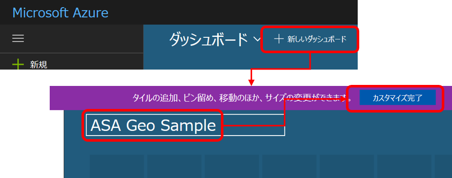 
次に、リソースグループを作成します。 図に従って、作成画面で”リソースグループ名”、”リソースグループの場所”を入力、選択し、”ダッシュボードにピン留めする”にチェックを入れて、”作成”ボタンをクリックします。 
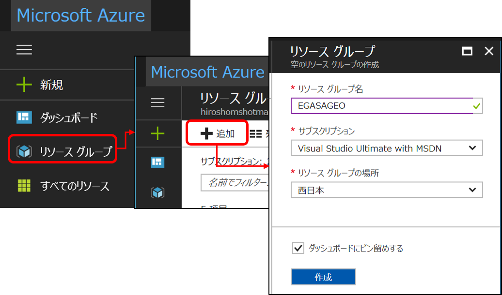 

#### 位置データを受信する、Event Hubの作成 
作成されたリソースグループを使って、Event Hubを作成します。 
フィルターで、”Event Hub”と入力すると候補が出ます。それをマウスで選択すると、Event Hubsがリストに現れます。 
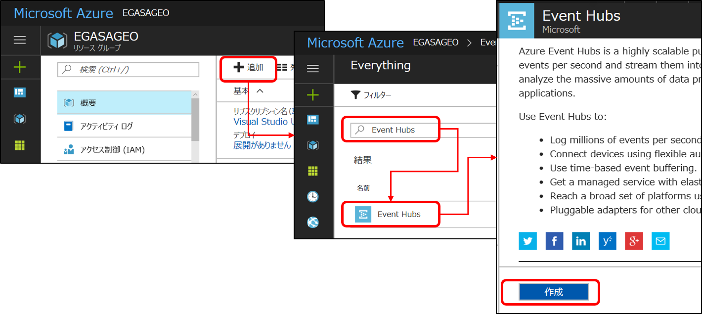 
”名前”は、右側に緑色の✔が表示される文字列であればなんでも構いません。インターネット上のEndpointとして使われます。ダッシュボードにピン留めは忘れずにチェックして、”作成”をクリックします。 
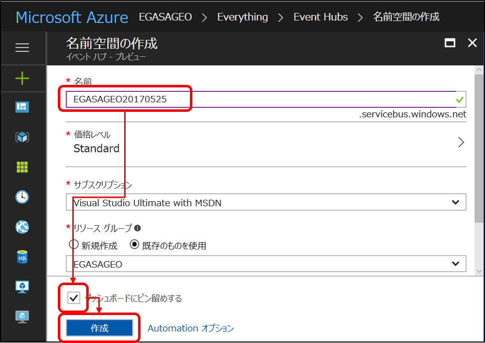 
これで、イベントハブを設置するための名前空間が出来上がります。 
”＋イベントハブ”をクリックし、”roottracking”という名前でイベントハブを作成します。スペルミスにご注意ください。 
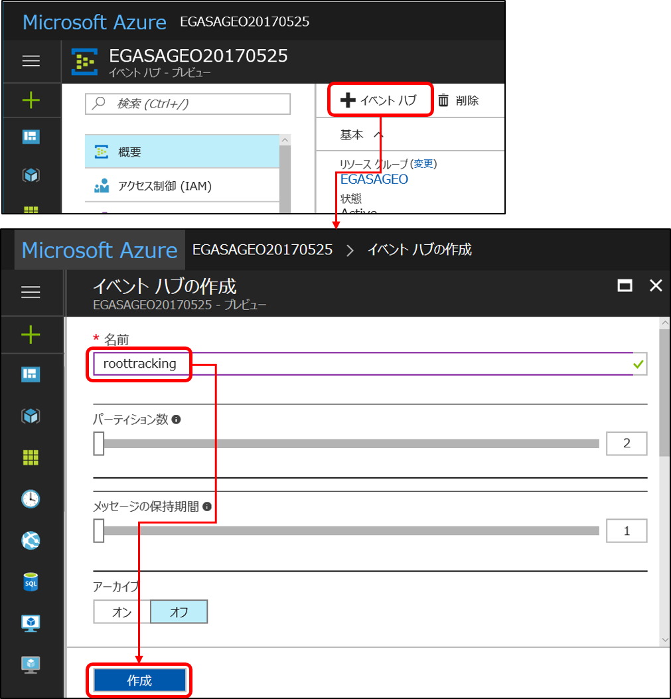 
ついでに、Stream Analyticsの処理結果を受信するEvent Hubも作っておきます。同じ要領で、”detected”という名前でEvent Hubをもう一つ作成します。 
作成したら、”イベントハブ”をクリックし、作成されたイベントハブを確認してください。”detected”と”roottracking”という二つのEvent HubができていればOKです。
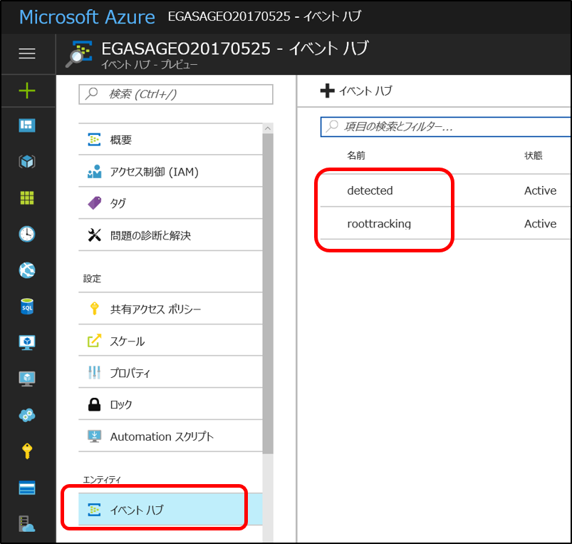 

作成完了したら、左上の”Microsoft Azure”をクリックして、ダッシュボードを表示しておきましょう。 
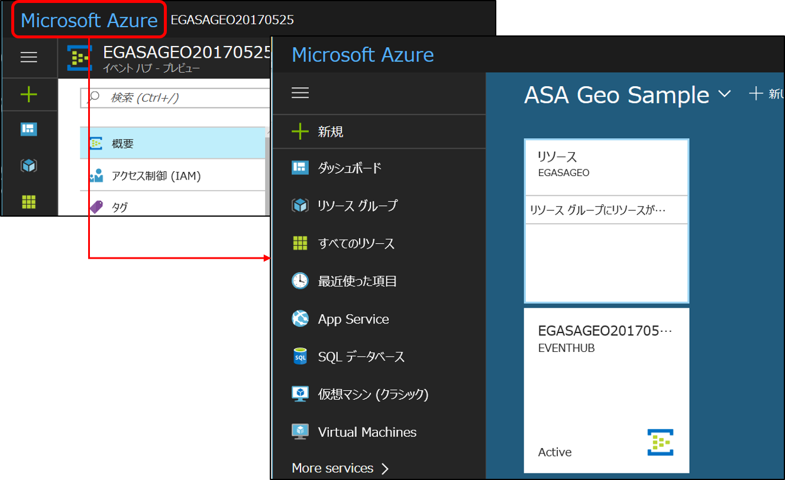 

#### ブロブの作成 
次に事前に登録する場所情報を格納するブロブを作成します。 リソースグループのタイルをクリックし、Event Hubを作成した時のように、”追加”→フィルターで”Storage”と入力、”Storage account - blob, file, table, queue”を選択して作成します。名前は、小文字の英数字のみ可能です。インターネット上で一意でなければなりません。 
 
これで、ブロブを作成するためのストレージアカウントが出来上がります。 
”BLOB”をクリックし、”place”という名前でコンテナを作成します。 
 
出来上がったコンテナに、data/place.json をアップロードしてください。このファイルには、新橋駅、パークタワーホテル、東京タワーの緯度経度が定義されています。 
 
```json
[
  {
    "ThingeeId": "Trip Guitor",
    "places": [
      {"id": "Shimbashi Station", "longitude": 139.758332, "latitude": 35.666193},
      {"id": "Park Tower Hotel", "longitude": 139.747072, "latitude": 35.655435},
      {"id": "Tokyo Tower", "longitude": 139.745433, "latitude": 35.658581}
    ]
  }
]
```
※現状のStream Analyticsのクエリ文法の制約から、検知したい場所のリストをモバイルデバイスに紐づけて定義しておく必要があります。この例ではJSONで定義していますが、CSVでの定義でも構いません。 

#### Stream Analytics の作成 
ダッシュボードに戻って、リソースグループタイルをクリックし、先の要領で、Stream Analyticsを作成します。 
 
名前を入力し、場所を選んで”作成”をクリックすればStream Analyticsの出来上がり。 
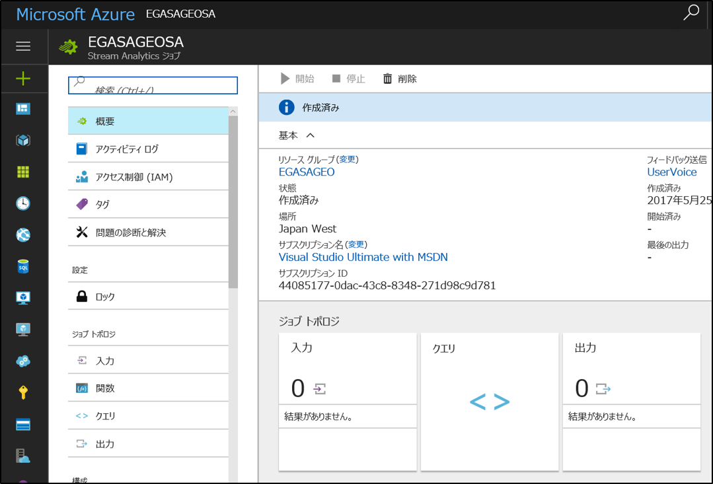 

次に、入力を作成します。モバイルデバイスからの位置情報メッセージ（Event Hubのroottracking）をデータストリームとして、ブロブのplace.jsonを参照として二つの入力を作成します。 
先ずは、”ジョブトポロジ”の”入力”をクリックして、”TrackingPoint”という名前で、”データストリーム”、”イベントハブ”と選択し、”サービスバス名前空間”を先ほど作ったイベントハブの名前空間に、”イベントハブの名前”は、”roottracking”を選択します。それ以外はデフォルトのままでOK。”作成”ボタンをクリックします。 
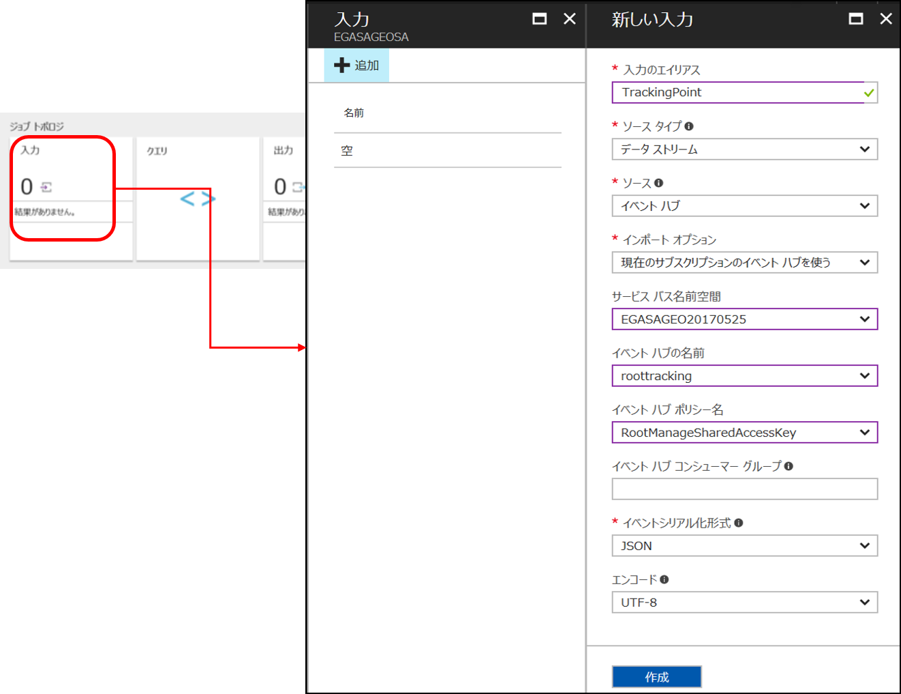 
もう一つ入力を作成します。名前は、”RegistedPlaces”と入力、”参照データ”を選択し、先ほど作成したブロブのストレージアカウントとコンテナを選択します。パスパターンは、”place.json”と入力します。”作成”をクリックして出来上がり。 
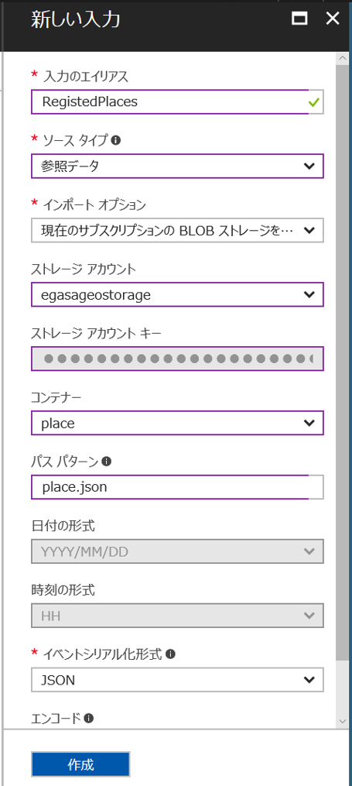 
次に出力を作成します。 
名前は、”Output”と入力、シンクは”イベントハブ”を選択、先ほど作っておいた、”detected”を選択して”作成”します。
 
次にクエリを作成します。クエリエディタを開いて、
```sql
WITH TP AS(
 SELECT
    CreatePoint(rt.latitude, rt.longitude) as tPosition,
    rt.id as thingId, rt.trackingTime,
    lplaces.ArrayValue.id as placeId,
    lplaces.ArrayValue.latitude as rLatitude,
    lplaces.ArrayValue.longitude as rLongitude
 FROM RootTracking rt TIMESTAMP BY trackingTime
 JOIN RegistedPlaces r on rt.id = r.ThingeeId
 CROSS APPLY GetArrayElements(r.places) as lplaces
)
-- 50m以下の場所を探す
SELECT *
INTO Output
FROM TP
WHERE ST_DISTANCE(tPosition,CreatePoint(rLatitude,rLongitude)) <50
```
と入力します。
一旦、モバイルデバイスに紐づけられた定義済みの場所情報をジョインしてリストを作り、その後、50メートル以下のレコードを見つけ出します。GetArrayElements関数で配列をばらしています。CreatePoint関数で、緯度経度から場所変数を作り、ST_DISTANCE関数で二点間の距離をメートルで計算しています。 
※現状、一つのクエリでCreatePoint関数は一個しかコールできないようです。 
このクエリは、[query/Script.asaql](query/Script.asaql)に入っています。 
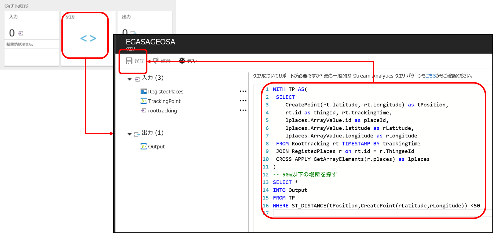

これで、クラウド側のサービス作成・定義は完了です。後は、”実行”をクリックすれば実行開始します。


### 位置情報サンプル生成アプリ 
[MovingPointGeneratorWPF](MovingPointGeneratorWPF)で公開しているSLNファイルをVisual Studioで開きます。TrackingLog.xamlファイルの24行目 
```xaml
<TextBox Name="tbEHCS" Grid.Column="2" Text="Service Bus Connection String" ToolTip="Event Hub Connection String"/>
```
のTextの値’Service Bus Connection String’を、Azure ポータルのEvent Hubの共有アクセスポリシーから得た接続文字列で置き換えます。 
ビルドして実行し、Tracking Startをクリックして、新しく開いたWindowのSendボタンをクリック後、ギターをマウスで動かすとその位置の緯度、経度が適宜Event Hubに通知されます。 

### Visual Studio 2017によるローカルテスト 
Under Construction 
